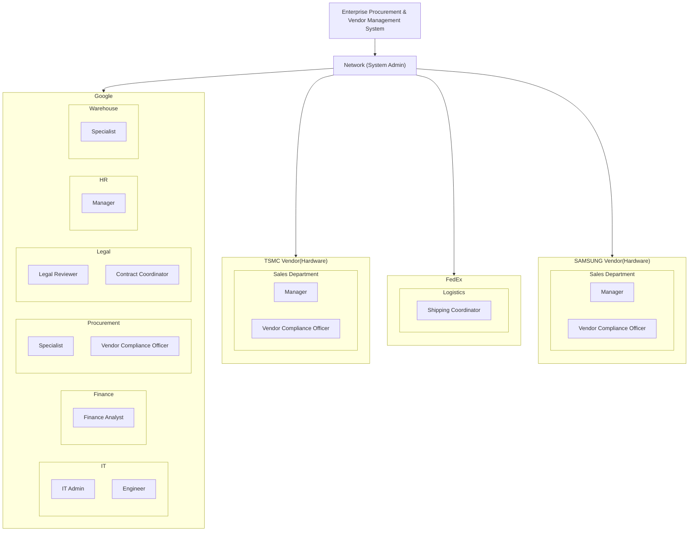
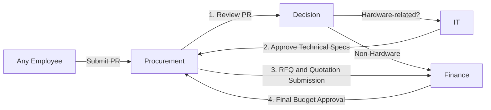
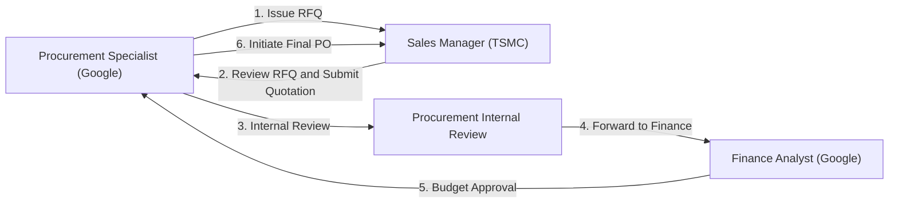
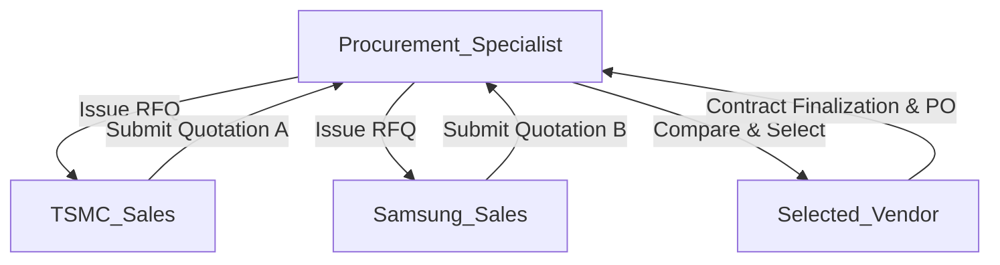
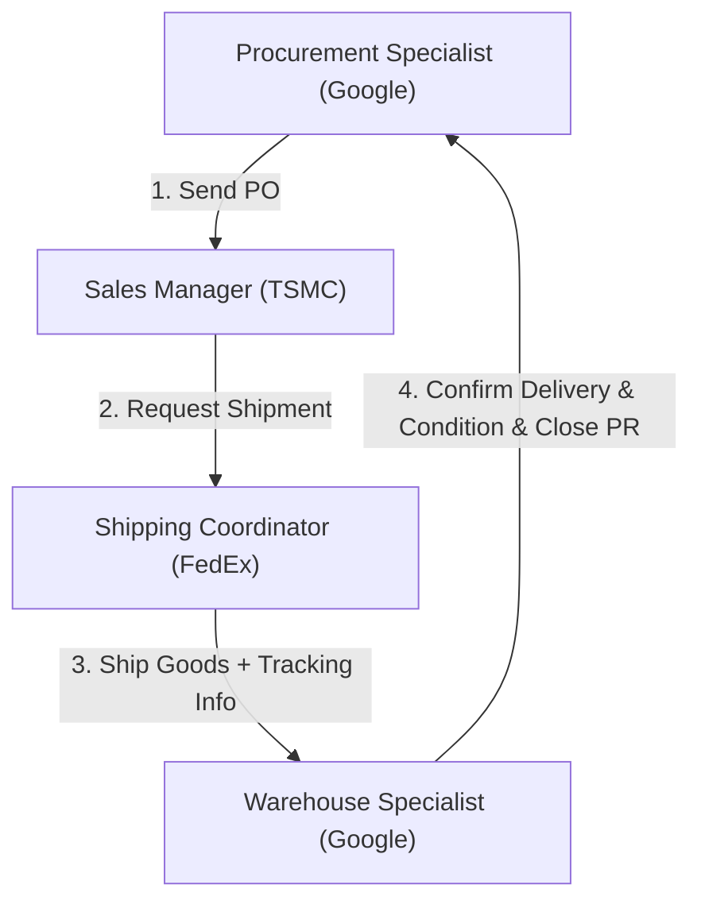

# Enterprise Procurement & Vendor Management System

## Overview

This project simulates an enterprise procurement and vendor management system, covering the complete workflow from purchase request (PR) initiation to quotation handling, contract issuance, shipping, and final delivery confirmation.
It models real-world interactions across multiple organizations (Google, TSMC, Samsung, FedEx) and departments, aiming to streamline procurement processes with robust logic and UI/UX enhancements.

> Note: This project uses Mermaid.js diagrams. GitHub currently does not natively render Mermaid syntax. For the best viewing experience, use a compatible Markdown viewer such as VSCode with Mermaid Preview.

---

## Table of Contents

- ️Technologies Used
- Project Highlights and Challenges
- System Architecture
- Business Workflow
    - Purchase Request (PR) Approval
    - Request for Quotation (RFQ) & Vendor Quotation
    - Shipment & Delivery
- Entities and Roles
- Key Features

---

## 🛠️ Technologies Used

- Java Swing: Built the desktop application’s user interface (UI) for a responsive and modular frontend.
- MVC Architecture:
    - Model: Business entities and system objects (e.g., PurchaseRequest, Quotation, Shipment).
    - View: Java Swing UI components organized by functional modules.
    - Coordinates UI actions and invokes service layer logic. Utilizes DTOs (Data Transfer Objects) to encapsulate structured data transfer between layers, ensuring clean separation and reducing coupling.
    - Service Layer: Encapsulates business rules, workflow validation, and status management, keeping the controller slim and maintainable.
- Mermaid.js: Used to create flowcharts and process diagrams in Markdown for easy visualization of system workflows.
- PlantUML: Created detailed class diagrams, relationship mappings, and structural overviews during system design.
- Git: Managed version control with branching strategies (feature branches, release branch).
- Linear: Managed task tracking, workflow planning, and project milestones.

---

## ✨ Project Highlights and Challenges

The core of this project was designing a procurement ecosystem where multiple enterprises (e.g., Google, TSMC, FedEx) could interact without tightly coupling their operations.

### Key challenges and highlights include:

- Ecosystem Separation:
    - Carefully designed the system to ensure that each network (enterprise entity) operates independently.
      Changes or workflows within one enterprise would not affect the state or data of another, preserving modularity and avoiding cross-contamination between organizations.

- Approval Workflow Design: Developed a robust multi-step approval mechanism that mirrors real-world business processes:

    - Every action was conditional on the successful completion of the previous step (e.g., RFQ issuance ➔ Quotation ➔ Internal Procurement Review ➔ Finance Budget Approval ➔ PO Issuance ➔ Shipment ➔ Delivery Confirmation).
    - Workflow status transitions were managed carefully to maintain a clear audit trail and ensure accountability at each stage.

- Flow-Based System:
    - Emphasized a true flow-driven system where each transaction, approval, and shipment is tightly linked in sequence.
      Every process in the system is base on the previous step, ensuring business rule integrity and creating a real-world-like procurement experience.

---

## 💡System Architecture

Each enterprise entity is connected to the system through their respective departments.

---

## Business Workflow

### Purchase Request (PR) Approval

---

### Request for Quotation (RFQ) & Vendor Quotation

PO transmission is permitted only after Finance finalizes the budget.

#### In multi-vendor scenarios:

---

### Shipment & Delivery

The delivery workflow handles the shipment process from vendor to Google’s warehouse, ensuring streamlined delivery confirmation and procurement closure.

#### Key System Notes

- PO Lifecycle: Once created and sent, the PO remains unchanged; there is no separate status management for the PO object.
- Shipment Lifecycle: The Shipment progresses from PLACED ➔ IN_TRANSIT ➔ DELIVERED, with the final delivery confirmation triggered by Google’s Warehouse Specialist.
- Delivery Confirmation: Google’s Warehouse Specialist confirms delivery, and the system automatically completes the associated PurchaseRequest (PR).

#### Step-by-Step Workflow

|**Step**|**Actor**|**Action**|**System Behavior**|
|---|---|---|---|
|1|Procurement Specialist (Google)|Sends the approved Purchase Order (PO) to the vendor (e.g., ASUS, TSMC).|PO is created and sent; no further status tracking on PO itself.|
|2|Sales Manager (Vendor)|Receives the PO and initiates a Delivery Request to FedEx. Simultaneously creates a Shipment object with receiver, item list, quantity, and an auto-generated tracking number.|Shipment status set to PLACED.|
|3|Shipping Coordinator (FedEx)|Reviews the Delivery Request, fills in shipment details (shipment date, expected arrival date = current date + 5 days), and accepts the request.|Shipment status updated to IN_TRANSIT; DeliveryRequest marked as ACCEPTED.|
|4|System|Updates Google’s internal UI. The Warehouse Specialist can view the shipment record with status IN_TRANSIT.|
|5|Warehouse Specialist (Google)|Upon physical receipt of the goods, clicks **“Confirm Delivery”** in the system to acknowledge successful receipt.|Shipment status updated to DELIVERED; the associated PurchaseRequest (PR) is automatically marked as COMPLETED.|

---

## 🍀 Entities and Roles

| **Role**             | **Organization** | **Department** | **Responsibility**                             |
| -------------------- | ---------------- | -------------- | ---------------------------------------------- |
| SYS_ADMIN            | System Admin     | System         | Manage network and enterprise setup            |
| IT_ADMIN             | Google           | IT             | Manage organization within enterprise          |
| MANAGER              | Google           | IT             | Technical spec approval for hardware PRs       |
| ENGINEER             | Google           | IT             | Technical consulting and support               |
| ANALYST              | Google           | Finance        | Budget approval for quotations                 |
| SPECIALIST           | Google           | Procurement    | Vendor management, RFQ handling, PO creation   |
| SPECIALIST           | Google           | Warehouse      | Receive shipments and confirm deliveries       |
| LEGAL_REVIEWER       | Google           | Legal          | Contract compliance review                     |
| MANAGER              | Google           | HR             | Employee account creation and management       |
| MANAGER              | Vendors          | Sales          | Quotation submission and shipment coordination |
| SHIPPING_COORDINATOR | FedEx            | Logistics      | Shipment execution and tracking                |

---

## ⭐️ Key Features

- Full Procurement Lifecycle: End-to-end flow from PR to delivery closure.
- Multi-Vendor RFQ Handling: Supports parallel RFQ and side-by-side quotation comparison.
- Finance Budget Control: Purchase Orders (POs) can only be initiated after Finance finalizes the budget.
- Shipment Tracking: Integration of vendor shipment and internal warehouse confirmation.
- Robust Workflow Enforcement: Approval checks and role-based actions embedded in logic. 
