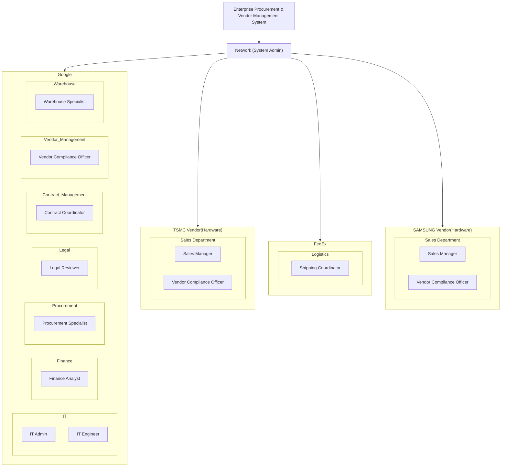
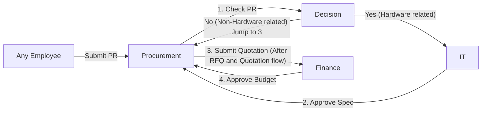
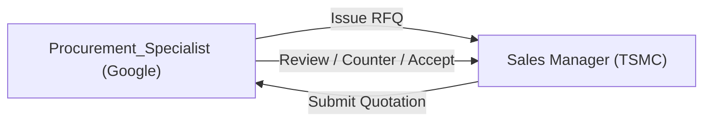
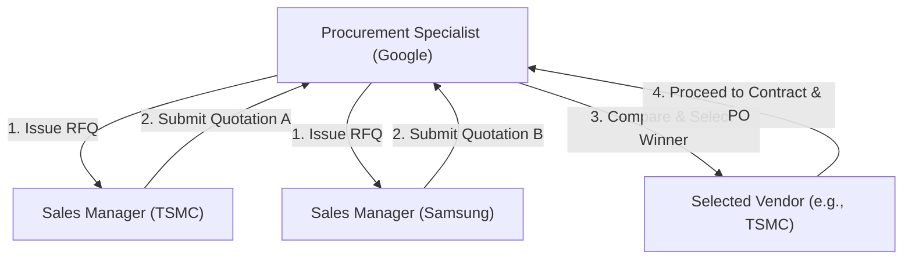
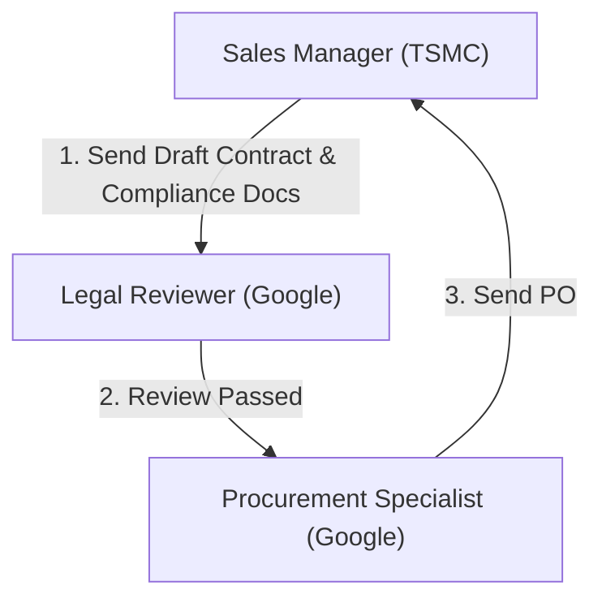
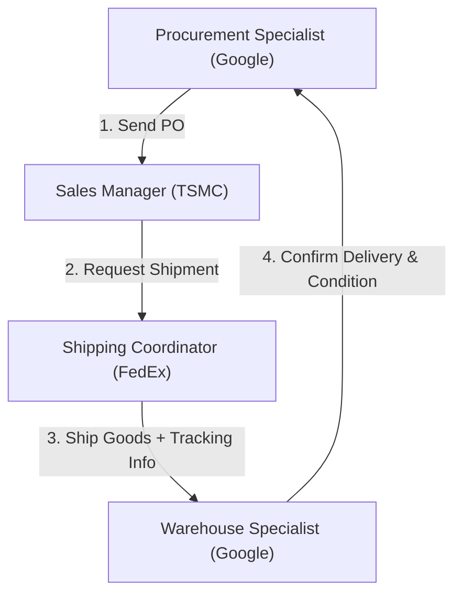

# Final Project Team 5: Enterprise Procurement & Vendor Management System

## Business Logic Overview

## PR Approval Flow

## RFQ and Quotation

In cases where multiple vendors are invited, the system supports side-by-side quotation comparison. The procurement team evaluates submitted offers and selects the most suitable vendor to proceed with contract finalization and PO issuance.

## Contract & PO Flow

Once the quotation has been accepted, the procurement process moves into the contract and purchase order phase. This phase ensures that all legal and financial considerations are addressed before placing a binding order.

> While the Procurement Specialist has the interface to initiate a PO, the actual transmission of the order to the vendor is only enabled after a Finance Analyst confirms the final budget. This ensures financial control without overly slowing down procurement operations.

## Shipment & Delivery

- FedEx ships the goods to Google’s warehouse and provides tracking information.
- Google Warehouse Specialist confirms delivery and condition of the goods, closing the delivery loop.

### Overview

1. The Procurement Specialist at Google sends the Purchase Order (PO) to the vendor after completing internal approvals. The PORequest status is set to PENDING.
2. The Sales Manager at the vendor (e.g., TSMC or Samsung) reviews and approves the PO. The PORequest status is updated to APPROVED.
3. The vendor sends a delivery request to FedEx and simultaneously initializes a Shipment object with basic information such as receiver, item list, and quantity. The Shipment status is set to PLACED.
4. The Shipping Coordinator at FedEx processes the shipment by filling in logistics details such as tracking number and expected delivery date (current date + 5 days). The Shipment status is updated to IN_TRANSIT.
5. The system updates Google’s interface, and the Warehouse Specialist can view the shipment record with a status of IN_TRANSIT.
6. Once the goods are delivered, the FedEx Shipping Coordinator marks the Shipment as DELIVERED.
7. The Warehouse Specialist at Google confirms physical receipt of the goods by clicking “Confirm Delivery.” The system automatically creates a DeliveryReceipt object with status INITIATED or PENDING_REVIEW.
8. The Procurement Specialist reviews the DeliveryReceipt, verifies that the shipment contents match the PO, fills in inspection details, and marks the DeliveryReceipt as COMPLETED. The PORequest is also updated to COMPLETED.
9. The Procurement Specialist creates a ProcurementClosure object linking the original PurchaseRequest and the completed DeliveryReceipt. The PurchaseRequest status is then set to COMPLETED, officially closing the procurement process.

### Step by Step
#### Step 1: Send Purchase Order (PO)

- **Actor**: Procurement Specialist (Google)
- **Action**: Sends the PO to the vendor after internal approvals.
- **Effect**: The PORequest status is set to PENDING.

#### **Step 2: Vendor Approves the PO**

- **Actor**: Sales Manager (TSMC or Samsung)
- **Action**: Reviews and approves the received PO.
- **Effect**: The PORequest status is updated to APPROVED.

#### **Step 3: Vendor Requests  Delivery and Initializes Shipment**

- **Actor**: Sales Manager (Vendor)
- **Action**: Sends a delivery request to FedEx and initializes a Shipment object with basic information (e.g., receiver, item list, quantity).
- **Effect**: The Shipment status is set to PLACED.

#### Step 4: **FedEx Processes Shipment**

- **Actor**: Shipping Coordinator (FedEx)
- **Action**: Updates the Shipment object with tracking number, expected delivery date (current date + 5 days), and other logistics details.
- **Effect**: The Shipment status is updated to IN_TRANSIT.

#### **Step 5: Google Receives Shipment Update** (Not sure yet)

- **Actor**: System / UI
- **Action**: Displays updated Shipment status in Google’s interface for internal users.
- **Effect**: The Warehouse Specialist sees the shipment as IN_TRANSIT.

#### **Step 6: FedEx Delivers the Goods**

- **Actor**: Shipping Coordinator (FedEx)
- **Action**: Marks the shipment as delivered in the system.
- **Effect**: The Shipment status is updated to DELIVERED.

#### **Step 7: Google Warehouse Confirms Delivery**

- **Actor**: Warehouse Specialist (Google)
- **Action**: Clicks “Confirm Delivery” to acknowledge that the shipment has physically arrived.
- **Effect**:
    - The system automatically creates a DeliveryReceipt with status INITIATED (or PENDING_REVIEW).
    - The receipt includes basic info (shipment ID, delivery timestamp, warehouse receiver).

#### **Step 8: Procurement Reviews and Confirms Delivery Receipt**

- **Actor**: Procurement Specialist (Google)
- **Precondition**: A DeliveryReceipt must exist (created by the warehouse).
- **Action**:
    - Reviews the delivery details.
    - Confirms item specs and quantities match the PO.
    - Updates the DeliveryReceipt with notes or findings.
    - Marks the receipt status as COMPLETED.
    - Updates the associated PORequest status to COMPLETED.
- **Effect**:
    - Delivery receipt is now officially verified and complete.
    - The PO is considered fulfilled from the procurement perspective.

#### Step 9: Procurement Creates ProcurementClosure

- Actor: Procurement Specialist (Google)
- Action:
    - Creates a ProcurementClosure object.
    - Links the PurchaseRequest and the now-completed DeliveryReceipt.
    - Marks the associated PurchaseRequest status as COMPLETED.
-	Effect:
     - Official closure of the procurement process.
     - Both PR and DeliveryReceipt are logically and formally connected for auditing or reporting purposes.