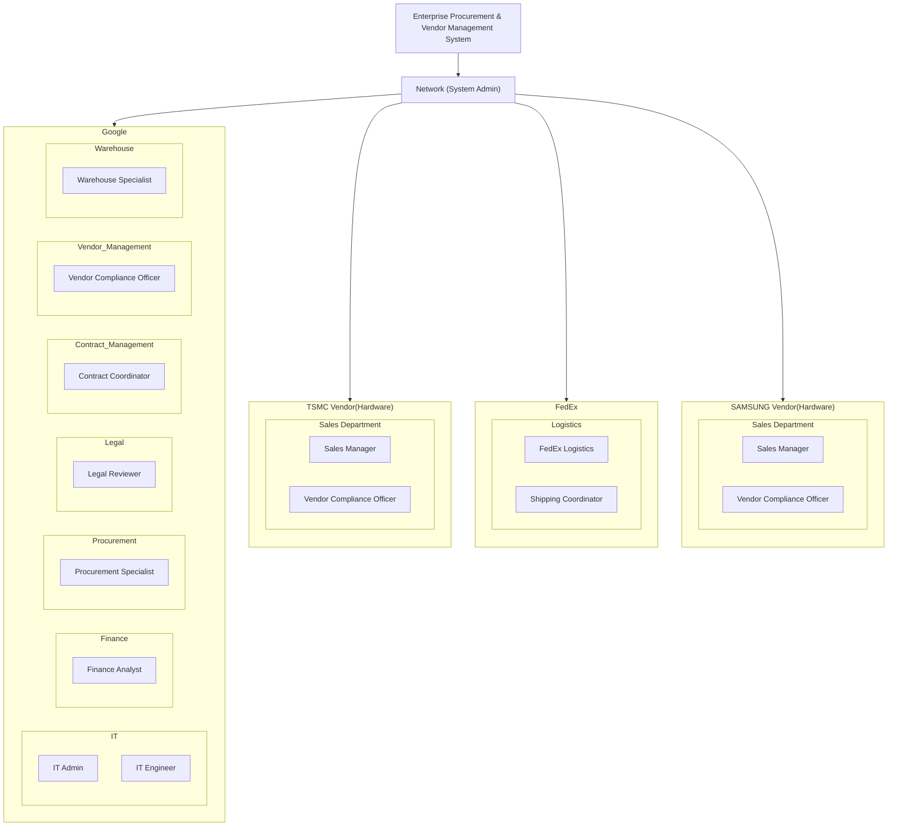

# Final Project Team 5: Enterprise Procurement & Vendor Management System

## Overview

## PR Approval Flow

## RFQ and Quotation

In cases where multiple vendors are invited, the system supports side-by-side quotation comparison. The procurement team evaluates submitted offers and selects the most suitable vendor to proceed with contract finalization and PO issuance.

## Contract & PO Flow

Once the quotation has been accepted, the procurement process moves into the contract and purchase order phase. This phase ensures that all legal and financial considerations are addressed before placing a binding order.

> While the Procurement Specialist has the interface to initiate a PO, the actual transmission of the order to the vendor is only enabled after a Finance Analyst confirms the final budget. This ensures financial control without overly slowing down procurement operations.

## Shipment & Delivery

- FedEx ships the goods to Google’s warehouse and provides tracking information.
- Google Warehouse Specialist confirms delivery and condition of the goods, closing the delivery loop.

